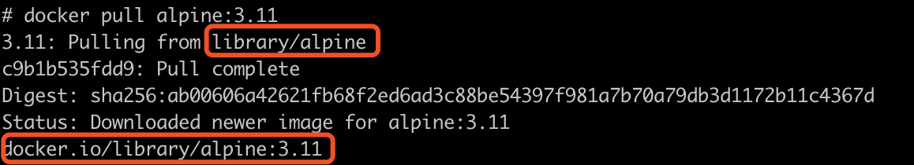

## 八、国内镜像加速
### 8.1、概述

​		很多人在使用docker或者kubernetes的时候碰到获取不到镜像或者拉取镜像比较慢的情况，我们常见到的镜像下载站主要包括：`docker.io`、`quay.io`、`gcr.io`、`k8s.gcr.io`。其实国内有很多代理和镜像站的，下面就教大家怎么不翻墙，并且快速的获取镜像。

​		国内主要的镜像站有[中科大](https://mirrors.ustc.edu.cn)和[Azure中国](https://mirror.azure.cn)，我个人更喜欢使用Azure中国的镜像站，因为Azure中国还有helm的仓库代理。


### 8.2、docker.io

​		这是docker官方的镜像仓库，也是我们用的最多的，拉取镜像的速度，大家也应该深有体会，那么怎么使用Azure中国镜像更快的拉取镜像呢？下面给大家讲述一下方法：


例如，你需要拉取的镜像是`alpine:3.11`：

```
docker pull alpine:3.11
```

那么使用Azure中国镜像，则是这样：

```
docker pull dockerhub.azk8s.cn/library/alpine:3.11
```

是不是很简单又快速？同时，可能有人注意到了，换成Azure中国镜像时为什么多了一个`library`路径？细心的同学可能已经发现了，实际上`alpine:3.11`的实际地址是`docker.io/library/alpine:3.11`。




如果拉取个人仓库的镜像，比如`prom/prometheus:2.16.0`：

```
docker pull prom/prometheus:v2.16.0
```

那么使用Azure中国镜像，则是这样：

```
docker pull dockerhub.azk8s.cn/prom/prometheus:v2.16.0
```

总结下来，其实就是将`docker pull xxx/yyy:zzz`替换为`docker pull dockerhub.azk8s.cn/xxx/yyy:zzz`。

另外，需要注意的是，这种方法不能保证100%拉取特别快速，当Azure中国镜像没有这个镜像缓存时，首先会从docker.io官方网站拉取并缓存，会稍微的慢一点。


### 8.3、quay.io

​		`quay.io`使用Azure中国镜像的规则和`docker.io`是一样的，只是这里是将`docker pull quay.io/xxx/yyy:zzz`替换为`docker pull quay.azk8s.cn/xxx/yyy:zzz`。


例如，拉取的镜像是`quay.io/kubernetes-ingress-controller/nginx-ingress-controller:0.30.0`：

```
docker pull quay.io/kubernetes-ingress-controller/nginx-ingress-controller:0.30.0
```

那么使用Azure中国镜像，则是这样：

```
docker pull quay.azk8s.cn/kubernetes-ingress-controller/nginx-ingress-controller:0.30.0
```


### 8.4、gcr.io

​		实际上`k8s.gcr.io`等价于`gcr.io/google-containers`，便将`k8s.gcr.io`和`gcr.io`放在一起说明。同时替换规则也是一样的，将`docker pull gcr.io/xxx/yyy:zzz`替换为`docker pull gcr.azk8s.cn/xxx/yyy:zzz`。


例如，拉取的镜像是`gcr.io/google-containers/coredns:1.6.5`：

```
docker pull gcr.io/google-containers/coredns:1.6.5
```

那么使用Azure中国镜像，则是这样：

```
docker pull gcr.azk8s.cn/google-containers/coredns:1.6.5
```


### 8.5、helm

Helm使用Azure中国的镜像仓库：

```
helm repo add stable http://mirror.azure.cn/kubernetes/charts
```

