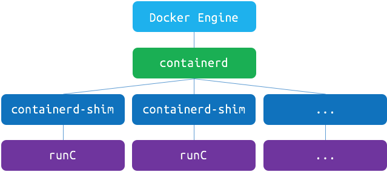

## 九、RunC

### 9.1、什么是RunC

​		RunC是一个轻量级的工具，它是用来运行容器的，只用来做这一件事，并且这一件事要做好。我们可以认为它就是个命令行小工具，可以不用通过docker引擎，直接运行容器。事实上，runC是标准化的产物，它根据OCI标准来创建和运行容器。而OCI（Open Container Initiative）组织，旨在围绕容器格式和运行时制定一个开放的工业标准。

​		RunC由Golang语言实现，基于libcontainer库。从docker 1.11开始，docker的架构图：




​		OCI由docker、coreos以及其他容器相关公司创建于2015年，目前主要有两个标准文档：[容器运行时标准 （runtime spec）](https://github.com/opencontainers/runtime-spec)和 [容器镜像标准（image spec）](https://github.com/opencontainers/image-spec)。

​		这两个协议通过 OCI runtime filesytem bundle 的标准格式连接在一起，OCI 镜像可以通过工具转换成 bundle，然后 OCI 容器引擎能够识别这个 bundle 来运行容器。


下面，我们来介绍这两个 OCI 标准。因为标准本身细节很多，而且还在不断维护和更新，如果不是容器的实现者，没有必须对每个细节都掌握。所以我以介绍概要为主，给大家有个主观的认知。

**image spec**

OCI 容器镜像主要包括几块内容：

- [文件系统](https://github.com/opencontainers/image-spec/blob/master/layer.md)：以 layer 保存的文件系统，每个 layer 保存了和上层之间变化的部分，layer 应该保存哪些文件，怎么表示增加、修改和删除的文件等
- [config 文件](https://github.com/opencontainers/image-spec/blob/master/config.md)：保存了文件系统的层级信息（每个层级的 hash 值，以及历史信息），以及容器运行时需要的一些信息（比如环境变量、工作目录、命令参数、mount 列表），指定了镜像在某个特定平台和系统的配置。比较接近我们使用 `docker inspect ` 看到的内容
- [manifest 文件](https://github.com/opencontainers/image-spec/blob/master/manifest.md)：镜像的 config 文件索引，有哪些 layer，额外的 annotation 信息，manifest 文件中保存了很多和当前平台有关的信息
- [index 文件](https://github.com/opencontainers/image-spec/blob/master/image-index.md)：可选的文件，指向不同平台的 manifest 文件，这个文件能保证一个镜像可以跨平台使用，每个平台拥有不同的 manifest 文件，使用 index 作为索引

**runtime spec**

OCI 对容器 runtime 的标准主要是指定容器的运行状态，和 runtime 需要提供的命令。下图可以是容器状态转换图：


- init 状态：这个是我自己添加的状态，并不在标准中，表示没有容器存在的初始状态
- creating：使用 `create` 命令创建容器，这个过程称为创建中
- created：容器创建出来，但是还没有运行，表示镜像和配置没有错误，容器能够运行在当前平台
- running：容器的运行状态，里面的进程处于 up 状态，正在执行用户设定的任务
- stopped：容器运行完成，或者运行出错，或者 `stop` 命令之后，容器处于暂停状态。这个状态，容器还有很多信息保存在平台中，并没有完全被删除


### 9.2、安装

​		RunC目前支持各种架构的Linux平台，必须使用Go 1.6以上构建才能使某些功能正常运行。需要启用seccomp支持，需要安装以下依赖：

```
yum -y install libseccomp-devel
or
apt-get -y install libseccomp-dev
```

​		Seccomp的全称是secure computing mode，即安全计算模型，这是Linux内核提供的功能。我们可以通过它来限制容器中进程的行为。更详细的内容可以参考[Seccomp security profiles for Docker](https://docs.docker.com/engine/security/seccomp/)。

获取runC代码

```
go get github.com/opencontainers/runc
```

编译安装

```
cd ~/go/src/github.com/opencontainers/runc/
make && make install
```

> 编译选项：
>
> | Build Tag | Feature                            | Dependency |
> | --------- | ---------------------------------- | ---------- |
> | seccomp   | syscall filtering                  | libseccomp |
> | selinux   | selinux process and mount labeling | <none>     |
> | apparmor  | apparmor profile support           | <none>     |
> | ambient   | ambient capability support         | kernel 4.3 |
>
> ```
> make BUILDTAGS='seccomp apparmor'
> ```

验证

```
runc -v
```


### 9.3、使用

​		要使用runc，必须使用OCI包的格式容器。如果安装了Docker，则可以使用其导出方法从现有Docker容器中获取根文件系统。

```
# create the top most bundle directory
mkdir /mycontainer
cd /mycontainer

# create the rootfs directory
mkdir rootfs

# export busybox via Docker into the rootfs directory
docker export $(docker create busybox) | tar -C rootfs -xvf -
```

runc提供了一个spec命令来生成您可以编辑的基本模板规范。

```
runc spec
```


### 9.4、运行容器

先来准备一个工作目录，下面所有的操作都是在这个目录下执行的，比如 mycontainer：

```
# mkdir mycontainer
```

接下来，准备容器镜像的文件系统，我们选择从 docker 镜像中提取：

```
# mkdir rootfs
# docker export $(docker create busybox) | tar -C rootfs -xvf -
# ls rootfs 
bin  dev  etc  home  proc  root  sys  tmp  usr  var
```

有了 rootfs 之后，我们还要按照 OCI 标准有一个配置文件 config.json 说明如何运行容器，包括要运行的命令、权限、环境变量等等内容，runc 提供了一个命令可以自动帮我们生成：

```
# runc spec
# ls
config.json  rootfs
```

这样就构成了一个 OCI runtime bundle 的内容，这个 bundle 非常简单，就上面两个内容：config.json 文件和 rootfs 文件系统。config.json 里面的内容很长，这里就不贴出来了，我们也不会对其进行修改，直接使用这个默认生成的文件。有了这些信息，runc 就能知道怎么怎么运行容器了，我们先来看看简单的方法 runc run（这个命令需要 root 权限），这个命令类似于 docker run，它会创建并启动一个容器：

```
runc run simplebusybox
/ # ls
bin   dev   etc   home  proc  root  sys   tmp   usr   var
/ # hostname
runc
/ # whoami
root
/ # pwd
/
/ # ip addr
1: lo: <LOOPBACK,UP,LOWER_UP> mtu 65536 qdisc noqueue qlen 1000
    link/loopback 00:00:00:00:00:00 brd 00:00:00:00:00:00
    inet 127.0.0.1/8 scope host lo
       valid_lft forever preferred_lft forever
    inet6 ::1/128 scope host 
       valid_lft forever preferred_lft forever
/ # ps aux
PID   USER     TIME   COMMAND
    1 root       0:00 sh
   11 root       0:00 ps aux
```

此时，另开一个终端，可以查看运行的容器信息：

```
runc list
ID              PID         STATUS      BUNDLE                                    CREATED                          OWNER
simplebusybox   18073       running     /home/cizixs/Workspace/runc/mycontainer   2017-11-02T06:54:52.023379345Z   root
```

